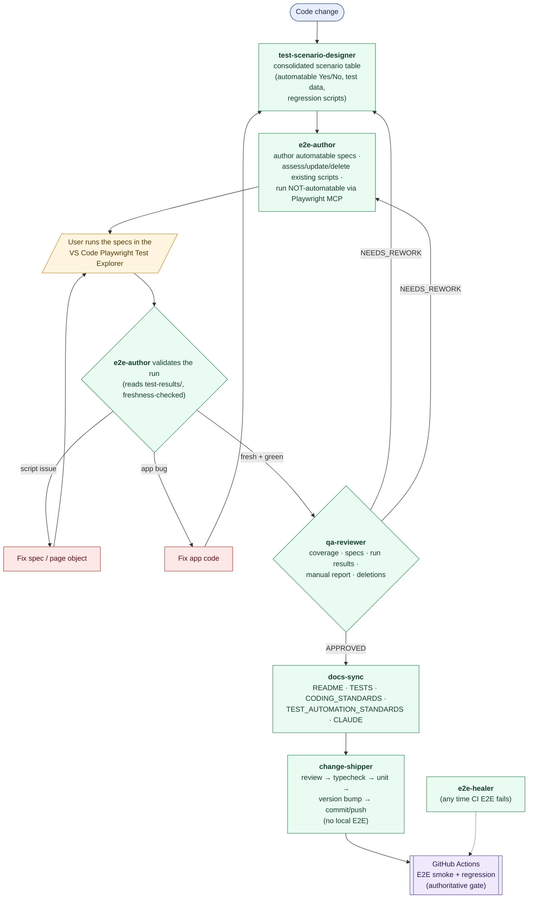

# Development Workflow (agent-driven SDLC)

How a change moves from code to shipped in this repo, and which agent owns each stage. The QA loop (test-scenario-designer → e2e-author → qa-reviewer) runs on every app behaviour/UI change; skip it only for docs-only, test-only, or CI/config-only changes.

Detailed procedures live in each agent under [`.claude/agents/`](.claude/agents/); this file is the map that ties them together.

## Stages

1. **Code change** — the feature, bug fix, or UI change is implemented (types → `lib/db.ts` → page). See [`CLAUDE.md`](CLAUDE.md) → "Adding a New Feature".

2. **`test-scenario-designer`** — enumerates the test scenarios driven by the change's functional impact and blast radius, consolidated (one shared control → one cross-page scenario; positive+negative merged). Outputs a single **scenario table** with an Automatable **Yes/No** tag, literal test data, and a list of existing regression scripts to re-run.
   - **Automatable = No** only for the five external touchpoints the Playwright suite can't drive: Resend email, AI receipt OCR, the daily cron, PWA/service-worker, and the mobile app. Everything Supabase-reachable is automatable.

3. **`e2e-author`** — splits the table two ways:
   - **Automatable → writes/updates specs + page objects** per [`TEST_AUTOMATION_STANDARDS.md`](TEST_AUTOMATION_STANDARDS.md), and **assesses existing scripts** (update / delete / regression).
   - **Not-automatable → executes them itself via Playwright MCP** and reports Pass/Fail/Blocked (✅/❌/🛑) with evidence.
   - It does **not** run the automated specs; it hands the user a bullet list of exactly which specs to run.

4. **User runs the specs** in the VS Code Playwright Test Explorer and tells `e2e-author` when done. (Nobody auto-runs the suite — this keeps token cost down.)

5. **`e2e-author` validates the run** by reading the `test-results/` artifacts (freshness-checked), and **gates it green** before review:
   - **Script issue** → fixes the spec/page object → user re-runs **all** specs → re-validate.
   - **App bug** → app is fixed → back to `test-scenario-designer` (existing + new scenarios for the fix) → `e2e-author` → user re-runs **all** specs → re-validate.
   - **Fresh + green** → hands off to `qa-reviewer`.

6. **`qa-reviewer`** — reviews coverage, the automatable/not-automatable split, spec soundness, the automated run results, the manual-test report, and deletions. Verdict **APPROVED** or **NEEDS_REWORK** (routed back to `test-scenario-designer` / `e2e-author`, or an app fix). Loop until APPROVED.

7. **`docs-sync`** — updates the five project docs (README, TESTS, CODING_STANDARDS, TEST_AUTOMATION_STANDARDS, CLAUDE) so none contradicts the change.

8. **`change-shipper`** — the local gate: code review → `typecheck` → unit tests → version bump (`apps/web/package.json`) → commit + push. It does **not** run E2E locally.

9. **GitHub Actions** (`.github/workflows/e2e.yml`) — runs the E2E smoke + regression jobs after the push/deploy. This is the **authoritative** E2E gate. If it fails, **`e2e-healer`** diagnoses (app-code-first) and fixes it.

## Notes
- Subagents can't invoke each other — **you (the main thread) orchestrate** the loop, passing each agent's output to the next.
- The QA loop applies to app behaviour/UI changes. For docs-only / test-only / CI-config-only changes, go straight to `docs-sync` → `change-shipper`.
